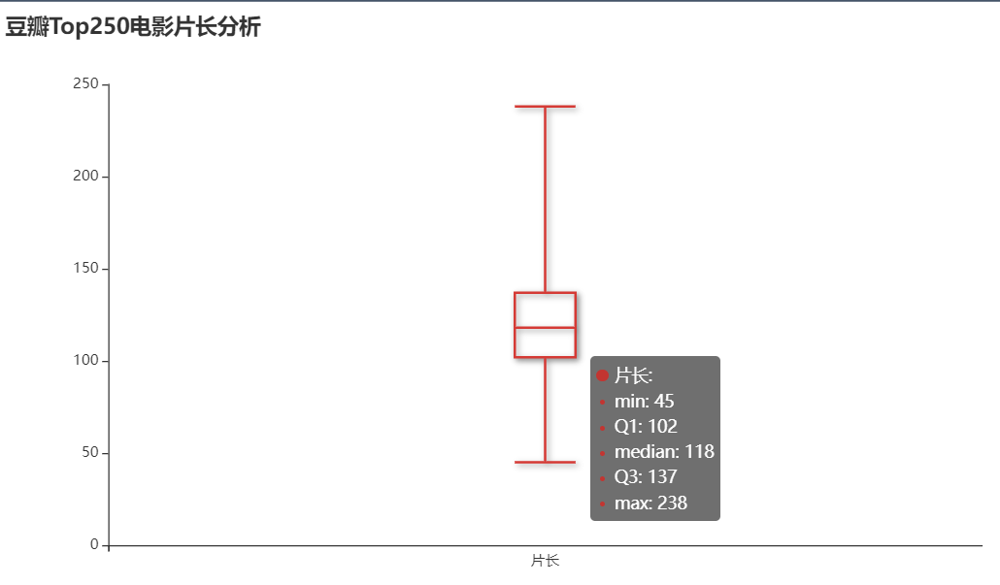
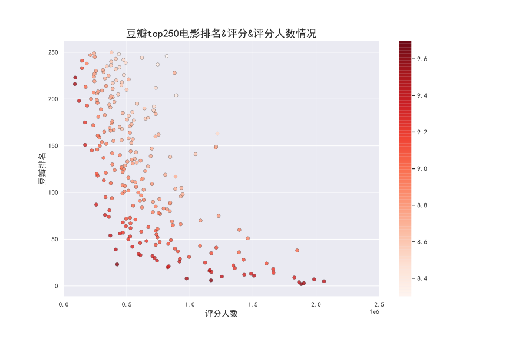

>分析时间：2022.01.23
# 豆瓣电影Top250
阿巛的第一个爬虫项目
## 1 分析部分
先展示分析的结果，具体脚本实现放在第二部分
### 1.1 电影上映日期分布情况

豆瓣top250电影中，最早的一部是在1931年，名称是卓别林主演的《城市之光》，最新一部是在2019年上映的《寄生虫》，大部分电影上映年份分布在1987年到2019年之间，其中，1994,2004,2010年最多，都是13部

```
2004    13
2010    13
1994    13
2015    11
2013    11
2003    10
2016    10
2008    10
2001     9
2009     9
2006     9
2014     9
1997     8
2011     8
2002     8
1993     7
1995     7
2018     6
1999     6
2012     5
2017     5
2000     5
1998     4
2007     4
1988     4
...
```
### 1.2 电影制片国家地区分布情况
豆瓣top250电影，有138部电影是美国出品的，超过一半；中国（含大陆、香港、台湾）出品的有63部,接着是日本和英国。


```
{'美国': 138, '日本': 35, '英国': 35, '中国香港': 30, '中国大陆': 25, '法国': 19, '德国': 17, '韩国': 12, '意大利': 10, '加拿大': 9, '中国台湾': 8, '澳大利亚': 5, '印度': 4, '瑞士': 4, '西班牙': 4, '新西兰': 3, '瑞典': 2, '巴西': 2, '墨西哥': 1, '黎巴嫩': 1, '塞浦路斯': 1, '卡塔尔': 1, '波兰': 1, '伊朗': 1, '丹麦': 1, '荷兰': 1, '奥地利': 1, '南非': 1, '阿根廷': 1, '希腊': 1, '泰国': 1, '爱尔兰': 1, '阿联酋': 1, '摩纳哥': 1, '捷克': 1, '比利时': 1, '匈牙利': 1, #: 1}
```
### 1.3 电影类型分布情况
可以看出，250部电影类型标签众多，有剧情、爱情、犯罪等等。

恐怖片也有上榜，是《电锯惊魂》和《惊魂记》。
```
155    电锯惊魂
171     惊魂记
```
跟制片国家/地区一样，一部电影可能有多个标签，所有类型标签加起来总共有694个，平均每部电影有2.776个标签，饼图显示27.23%的标签是剧情，但并不意味着有27.23%的电影是属于剧情片，实际上，剧情标签数量是189个，实际意味着250部电影里有189是属于剧情电影，占比达到75.6%，接近3/4，爱情电影、喜剧电影其次。

### 1.4 电影导演分析


可以看到，宫崎骏第一，有8部电影入围豆瓣Top250，史蒂文·斯皮尔伯格和克里斯托弗·诺兰都有6部入围豆瓣Top250,中国导演李安、王家卫分别都有5部电影入围豆瓣Top250，刘镇伟、姜文分别有3部电影入围豆瓣Top250，星爷只有2部呜呜┭┮﹏┭┮。

宫崎骏导演入围豆瓣电影Top 250的八部电影为：
```
6         千与千寻
24          龙猫
39     哈尔的移动城堡
43        天空之城
107       幽灵公主
164        风之谷
196      魔女宅急便
231      崖上的波妞
```

克里斯托弗·诺兰导演入围豆瓣电影Top 250的六部电影为
```
8            盗梦空间
10           星际穿越
28       蝙蝠侠：黑暗骑士
77           致命魔术
114    蝙蝠侠：黑暗骑士崛起
172          记忆碎片
```
史蒂文·斯皮尔伯格导演入围豆瓣电影Top 250的六部电影为
```
7      辛德勒的名单
44       猫鼠游戏
70     拯救大兵瑞恩
128     幸福终点站
148      头号玩家
201      人工智能
```
李安导演入围豆瓣电影Top 250的5部电影为
```text
40     少年派的奇幻漂流
61         饮食男女
102         断背山
153          喜宴
189         色，戒
```
墨镜王导演入围豆瓣电影Top 250的5部电影为
```text
85     春光乍泄
108    重庆森林
157    花样年华
181    东邪西毒
233    阿飞正传
```
星爷导演入围豆瓣电影Top 250的2部电影为
```
88    喜剧之王
95      功夫
```

### 1.5 电影主演分析


可以看到很多演员主演的电影质量是很高的，中国演员张国荣、梁朝伟主演的电影，分别有8部入围豆瓣top250，张曼玉有7部入围,周星驰有6部入围；
- 张国荣入围的八部电影：《霸王别姬》, 《春光乍泄》, 《倩女幽魂》, 《射雕英雄传之东成西就》, 《英雄本色》, 《纵横四海》, 《东邪西毒》, 《阿飞正传》
- 星爷入围的六部电影：《大话西游之大圣娶亲》, 《大话西游之月光宝盒》, 《喜剧之王》, 《功夫》, 《唐伯虎点秋香》, 《九品芝麻官》
- 张国荣、梁朝伟一起主演的电影有4部入围，分别是《春光乍泄》、《射雕英雄传之东成西就》、《东邪西毒》、《阿飞正传》。

### 1.6 电影片长分析

250部电影片长分布挺集中的，其中，最长的电影有238分钟，最短的只有45分钟，平均片长是118分钟，通过查看数据可以发现，片长最长的是《乱世佳人》，片长最短的是《萤火之森》。

### 1.7 电影排名&评分&评分人数情况分析
用matplotlib绘图，将电影排名、评分、评分人数，3个维度的数据绘制在一张图上，更加直观

豆瓣电影Top250中的所有电影评分都在8分以上，最低评分8.3是国产电影《驴得水》，最高评分9.7《肖申克的救赎》,豆瓣电影TOP250中TOP50的平均得分高达 9.266。评分人数大部分在100万以内,只有35部高于100万人次评价,其中27部都是排名TOP50以内的电影。可以大致看出，非常经典的电影，豆瓣排名、评分人数、评分都很高。


在电影评分人数TOP20中,可以看到肖申克的救赎不愧为榜1,253万评分人次,独领风骚,其次是这个杀手不太冷206万评分,千与千寻198万评分,阿甘正传190万评分人次。
中国电影里，霸王别姬没想到评分人次最多，有188万，其次是《我不是药神》185万，B站用户玩梗最多的《让子弹飞》第三146万。
> 很遗憾的说,我还没看过霸王别姬,年龄太小啦,看也看不懂，确实没想到是最多人评分的

按评分人数排序展示国产电影
|   排名 | 电影名称             | 导演                  | 编剧                                                 |   评分 |   评分人数 |
|-------:|:---------------------|:----------------------|:-----------------------------------------------------|-------:|-----------:|
|      2 | 霸王别姬             | 陈凯歌            | 芦苇/李碧华                                          |    9.6 |    1883284 |
|     38 | 我不是药神           | 文牧野            | 韩家女/钟伟/文牧野                                   |    9   |    1850246 |
|     51 | 让子弹飞             | 姜文              | 朱苏进/述平/姜文/郭俊立/危笑/李不空/马识途           |    8.9 |    1459151 |
|     19 | 大话西游之大圣娶亲   | 刘镇伟            | 刘镇伟                                               |    9.2 |    1356821 |
|     17 | 无间道               | 刘伟强, 麦兆辉  | 麦兆辉/庄文强                                        |    9.3 |    1158047 |
|     43 | 大话西游之月光宝盒   | 刘镇伟            | 刘镇伟/吴承恩                                        |    9   |    1081145 |
|    105 | 唐伯虎点秋香         | 李力持            | 李力持/谷德昭/陈文强                                 |    8.7 |     933176 |
|     96 | 功夫                 | 周星驰            | 曾瑾昌/陈文强/周星驰/霍昕                            |    8.7 |     928667 |
|     89 | 喜剧之王             | 周星驰, 李力持  | 曾瑾昌/周星驰/李敏/郑文辉/冯勉恒/梁嘉杰              |    8.8 |     844898 |
|    246 | 驴得水               | 周申, 刘露      | 周申/刘露                                            |    8.3 |     816355 |
|     30 | 活着                 | 张艺谋            | 芦苇/余华                                            |    9.3 |     720488 |
|    188 | 疯狂的石头           | 宁浩              | 张承/宁浩/岳小军                                     |    8.5 |     712455 |
|    109 | 重庆森林             | 王家卫            | 王家卫                                               |    8.8 |     700027 |
|    123 | 倩女幽魂             | 程小东            | 阮继志                                               |    8.8 |     646532 |
|    190 | 色，戒               | 李安              | 王蕙玲/詹姆斯·夏慕斯/张爱玲                          |    8.6 |     639702 |
|    136 | 射雕英雄传之东成西就 | 刘镇伟            | 刘镇伟                                               |    8.7 |     563927 |
|    177 | 九品芝麻官           | 王晶              | 王晶                                                 |    8.6 |     556632 |
|     86 | 春光乍泄             | 王家卫            | 王家卫                                               |    9   |     550544 |
|     42 | 鬼子来了             | 姜文              | 姜文/史建全/述平/尤凤伟                              |    9.3 |     544031 |
|    112 | 阳光灿烂的日子       | 姜文              | 姜文/王朔                                            |    8.8 |     543219 |
|    182 | 东邪西毒             | 王家卫            | 王家卫/金庸                                          |    8.6 |     516572 |
|    158 | 花样年华             | 王家卫            | 王家卫                                               |    8.7 |     515153 |
|    168 | 英雄本色             | 吴宇森            | 陈庆嘉/吴宇森/梁淑华                                 |    8.6 |     462169 |
|    215 | 青蛇                 | 徐克              | 李碧华/徐克                                          |    8.6 |     457452 |


## 2 爬虫部分

爬虫部分的脚本主要功能有两个
1. 解析豆瓣电影Top页面，获得250部电影的信息，汇总成表格
2. 把250部电影的封面图下载到[anlysis/](anlysis/)文件夹中
    

douban250_page.py 是只对[豆瓣电影Top250页面](https://movie.douban.com/top250)进行解析，即只解析10个页面，得到的豆瓣Top250_page.xlsx没有编剧、演员信息

douban250.py 则除了解析豆瓣电影Top250页面，还会对每部电影进行解析，得到的豆瓣Top250.xlsx 汇总比较全面

注意：由于脚本会解析10+250=260个页面，必须要有豆瓣登陆的cookie才能正常运行的，因为会被豆瓣识别为异常访问，限制ip访问的
获取豆瓣cookie见，

只需要按照上图的方法，将复制的cookie替换douban250.py中ua_ck()函数的cookies变量


